<p align="center">
  
</p>

<p align="center">
  <a href="https://www.linkedin.com/in/laecioneves/"></a>
  <a href="mailto:laeciojesusn@gmail.com"></a>
</p>

<br>

### Sobre mim

```java
public class Laecio {
    String cargo    = "Estagiário de Desenvolvimento @ Develcode";
    String formacao = "ADS (Senac-DF) + Sistemas de Informação (em andamento)";
    String foco     = "APIs com Spring Boot e automação de processos";
    String extra    = "DIO Campus Expert #16";
}
```

<br>

### Stack

<p align="left">
  <br>
  
</p>

<br>

### Certificações

<p align="left">
  <a href="#"></a>
  <a href="#"></a>
  <a href="#"></a>
  <a href="#"></a>
</p>

<br>

### Atividade

<p align="center">
  
  
</p>

<p align="center">
  
</p>

<p align="center">
  
</p>

<p align="center">
  <picture>
    <source media="(prefers-color-scheme: dark)" srcset="https://raw.githubusercontent.com/laeciojn/laeciojn/output/github-contribution-grid-snake-dark.svg">
    <source media="(prefers-color-scheme: light)" srcset="https://raw.githubusercontent.com/laeciojn/laeciojn/output/github-contribution-grid-snake.svg">
    
  </picture>
</p>
