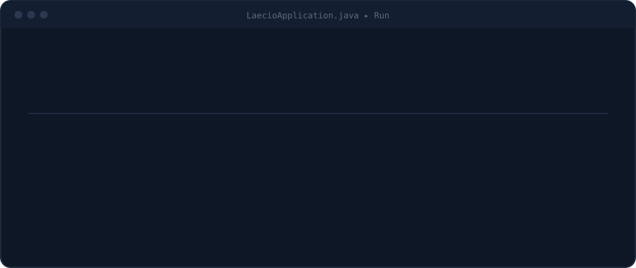

<p align="center">
  
</p>

<p align="center">
  <a href="https://www.linkedin.com/in/laecioneves/"></a>
  <a href="mailto:laeciojesusn@gmail.com"></a>
</p>

<br>

### Sobre mim

Sou desenvolvedor backend focado em criar soluções escaláveis, automatizar processos e entregar APIs robustas com Java e Spring Boot. Atualmente estou em formação em Sistemas de Informação e tenho interesse especial em backend, integração de sistemas, bancos de dados e produtividade com ferramentas de automação.

```java
public class Laecio {
    String cargo    = "Estagiário de Desenvolvimento de Software";
    String formacao = "Sistemas de Informação";
    String foco     = "APIs com Spring Boot, automação e integração de sistemas";
}
```

<br>

### Stack

<p align="left">
  <br>
  
</p>

<br>

### Atualmente

- Desenvolvimento de APIs REST com Java e Spring Boot
- Integração com banco de dados SQL e NoSQL
- Automação de processos e fluxos de trabalho
- Criação de soluções orientadas a performance e manutenção

<br>

### Certificações

<p align="left">
  <a href="#"></a>
  <a href="#"></a>
  <a href="#"></a>
  <a href="#"></a>
</p>

<br>

### GitHub


<p align="center">
  
</p>

<p align="center">
  <picture>
    <source media="(prefers-color-scheme: dark)" srcset="https://raw.githubusercontent.com/laeciojn/laeciojn/output/github-contribution-grid-snake-dark.svg">
    <source media="(prefers-color-scheme: light)" srcset="https://raw.githubusercontent.com/laeciojn/laeciojn/output/github-contribution-grid-snake.svg">
    
  </picture>
</p>
